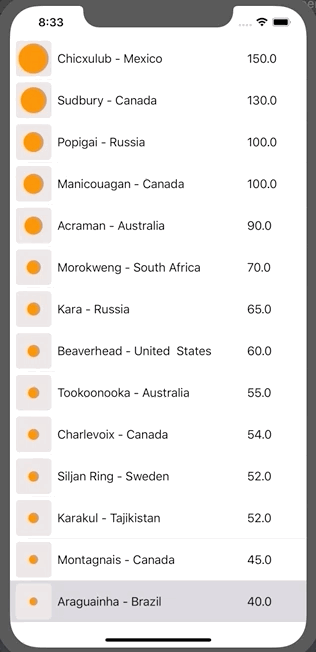

# ImpactCraters
Project to play around with SF Symbols



## Requirements
* Xcode 11.3 or higher

ImpactCraters has no dependencies. To run it, just launch ImpactCraters.xcodeproj in Xcode and build the project.

## Points of Interest
* This app shows a list of impact craters on Earth. Each crater has a name, a country and a diameter measured in km.
* The SF Symbol ```"circle.fill"``` is used as an icon to represent each crater.
* The circle is scaled up or down to represent a large or small crater.
* It's important to ensure the image view's content mode is set to ```centre``` for this to work correctly.

## To do
* Add in a nice section header.
* Add the ability to sort craters by name or diameter or location.
* Turn off cell selection.

## Acknowledgments

The data used in this app is a list of impact craters on Earth from [this wiki page](https://en.wikipedia.org/wiki/List_of_impact_craters_on_Earth).
